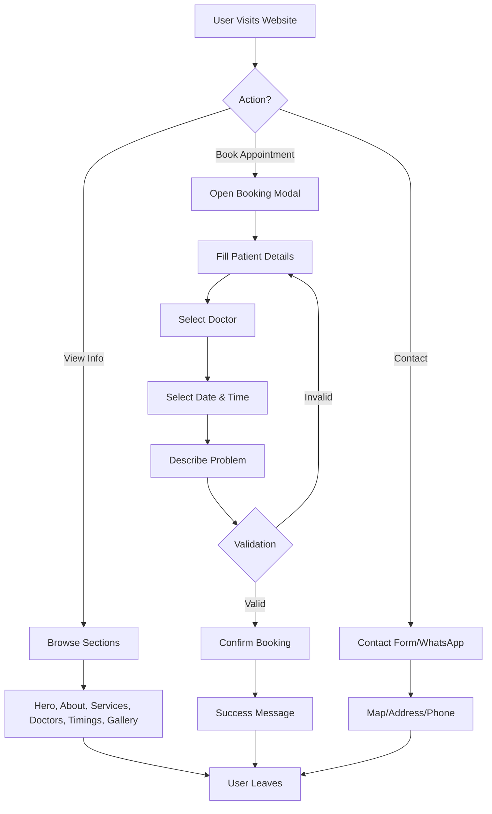

# Product Requirements Document (PRD)
## Vatsalya Child & Dental Specialty Hospital Website

---

## 1. Product Overview

Vatsalya Child & Dental Specialty Hospital is a modern healthcare website designed for a pediatric and dental care center located in Deoghar, Jharkhand, India. The website aims to provide comprehensive information about the hospital's services, doctors, timings, and facilitate appointment bookings for patients.

**Target Users:**
- Local residents of Deoghar and nearby villages
- Pilgrims visiting Baidyanath Dham who may need medical help
- Parents seeking pediatric care for their children
- Patients requiring dental treatments

**Key Value Propositions:**
- Child-friendly, trustworthy, and clean design
- Easy appointment booking functionality
- Multilingual support (Hindi, English, Bengali, and regional languages)
- Mobile-first responsive design
- Fast loading and SEO-friendly

---

## 2. Core Features

### 2.1 User Roles
| Role | Description | Permissions |
|------|-------------|-------------|
| Visitor | General website visitor | View all public information, book appointments |
| Patient | Registered patient | Book appointments, view appointment history |
| Admin | Hospital administrator | Manage appointments, update content |

### 2.2 Feature Modules

1. **Home Page (Hero Section)**
   - Beautiful hero image with hospital exterior
   - Hospital name and tagline overlay
   - Call-to-Action buttons: "Book Appointment" & "Call Now"
   - Animated background elements

2. **About Us Section**
   - Brief introduction of the hospital
   - Mission and vision statements
   - Family-friendly warm tone
   - Statistics (years of service, patients treated, etc.)

3. **Our Doctors Section**
   - Professional cards for Dr. Prateek Priya (Pediatrician)
   - Professional cards for Dr. Smriti Shrivastav (Dentist)
   - Photos, qualifications, experience, and specialties
   - Hover animations on cards

4. **Services Section**
   - Pediatric Consultation (Child Diseases)
   - General & Pediatric Dentistry
   - Dental Procedures (Scaling, Filling, Extraction)
   - Routine Child Health Checkups
   - Vaccination Guidance
   - Emergency Dental Care
   - Grid layout with icons and descriptions

5. **OPD Timings Section**
   - Clear, highlighted timing table
   - Monday to Saturday: 10:00 AM – 2:00 PM & 5:00 PM – 8:00 PM
   - Sunday: By Appointment Only
   - Visual calendar-style display

6. **Gallery Section**
   - Showcase hospital images
   - Hospital exterior, reception, dental chair, clinic interior
   - Lightbox functionality for full-size viewing
   - Masonry grid layout

7. **Contact & Location Section**
   - Contact form (Name, Phone, Email, Message)
   - WhatsApp floating button
   - Google Maps embed
   - Full address: Vaidyanatham Station Road, Castors Town, Deoghar, Jharkhand - 814112
   - Phone: +91 82921 14160

8. **Appointment Booking Modal**
   - Floating "Book Appointment" button
   - Modal form with fields:
     - Patient Name
     - Patient Age
     - Select Doctor
     - Preferred Date
     - Preferred Time
     - Phone Number
     - Problem Description
   - Form validation
   - Success confirmation

9. **Testimonials Section**
   - Patient testimonials carousel
   - Star ratings
   - Quotes from satisfied patients
   - Auto-rotating slider

10. **Footer**
    - Quick links
    - Contact information
    - Social media links
    - Copyright notice
    - Privacy policy and terms links

### 2.3 Page Details

| Page/Section | Module Name | Feature Description |
|--------------|-------------|---------------------|
| Hero Section | Hero Banner | Full-screen hero with animated background, overlay text, CTA buttons with hover effects |
| About Us | Introduction | Two-column layout with image and text, statistics counter animation |
| Our Doctors | Doctor Cards | Responsive card grid with flip or hover animations, modal for details |
| Services | Service Grid | Icon-based cards with hover lift effect, categorized by service type |
| OPD Timings | Schedule Display | Visual timetable with color-coded time slots, mobile-friendly layout |
| Gallery | Image Gallery | Masonry layout, lightbox viewer, lazy loading for images |
| Contact | Contact Form | Form with validation, map integration, floating WhatsApp button |
| Appointment | Booking Modal | Multi-step or single form modal, date/time picker, doctor selection |
| Testimonials | Review Slider | Carousel with auto-play, manual navigation, star ratings |
| Footer | Site Footer | Multi-column layout, newsletter signup, social links |

---

## 3. Core Process

### User Flow - Booking an Appointment

1. User visits the website homepage
2. User clicks "Book Appointment" button (in Hero or floating button)
3. Modal opens with appointment form
4. User fills in patient details (name, age, phone)
5. User selects doctor (Dr. Prateek Priya or Dr. Smriti Shrivastav)
6. User selects preferred date and time
7. User describes the problem
8. Form validates all fields
9. User confirms the booking
10. Success message is displayed with appointment details
11. User receives confirmation via WhatsApp/SMS (optional)

### Mermaid Flowchart

---

## 4. User Interface Design

### 4.1 Design Style

**Color Palette:**
- **Primary Color:** Soft Blue (#4A90D9) - Represents trust, calmness, healthcare
- **Secondary Color:** Soft Pink (#F8B4C0) - Child-friendly, warm, caring
- **Accent Color:** Mint Green (#7DD3C0) - Fresh, healthy, growth
- **Background:** White (#FFFFFF) and Light Gray (#F5F7FA)
- **Text:** Dark Gray (#2D3748) for readability

**Typography:**
- **Heading Font:** Poppins - Modern, friendly, professional
- **Body Font:** Inter - Clean, highly readable
- **Accent Font:** Nunito - Rounded, child-friendly for special elements

**Button Styles:**
- Primary: Solid blue with white text, rounded corners (8px), subtle shadow
- Secondary: Outlined with blue border, transparent background
- Hover: Slight scale (1.05) and shadow increase
- CTA: Gradient background (blue to purple), pulsing animation

**Card Styles:**
- White background with subtle border
- Rounded corners (12px)
- Soft shadow on hover
- Subtle border accent (top or left) in brand colors

**Layout Style:**
- Mobile-first responsive design
- Generous whitespace
- Asymmetric grid layouts for visual interest
- Section dividers with wave or curve shapes

**Icon Style:**
- Lucide React icons - clean, consistent line style
- Color-matched to section themes
- Animated on hover (bounce, rotate)

**Animations:**
- Scroll-triggered reveal animations
- Smooth transitions (300-500ms)
- Parallax effects on hero section
- Counter animations for statistics
- Floating elements (subtle up-down motion)

### 4.2 Page Design Overview

| Section | Module Name | UI Elements |
|---------|-------------|-------------|
| Navigation | Header | Fixed header, logo, nav links, book appointment button, mobile hamburger menu |
| Hero | Hero Banner | Full viewport height, animated gradient background, floating medical icons, headline with typewriter effect, dual CTA buttons, scroll indicator |
| About | About Section | Two-column layout, large image with frame, text content with accent border, animated counters for stats, trust badges |
| Doctors | Doctor Cards | Section header with decorative element, responsive card grid (2 columns), doctor photo placeholder, qualification badges, specialty tags, hover lift effect |
| Services | Service Grid | Icon-based cards in 3-column grid (2 on mobile), gradient icon backgrounds, hover card expansion, service category tabs (optional) |
| Timings | Schedule Display | Visual timetable with color-coded sessions, current day highlight, mobile-optimized card view, legend for symbols |
| Gallery | Image Gallery | Masonry grid layout (3 columns desktop, 2 tablet, 1 mobile), thumbnail images, lightbox modal for full view, lazy loading |
| Testimonials | Review Slider | Carousel with navigation dots, star ratings, quote styling, auto-rotate, patient photos (placeholders) |
| Contact | Contact Section | Two-column layout, contact form with validation, contact info cards, embedded map iframe, floating WhatsApp button |
| Appointment Modal | Booking Form | Modal overlay with form, step indicators, date/time picker, doctor selection dropdown, validation, success animation |
| Footer | Site Footer | Multi-column layout, quick links, contact info, social media icons, newsletter signup, copyright, back-to-top button |

### 4.3 Responsiveness

**Breakpoints:**
- Mobile: 320px - 639px
- Tablet: 640px - 1023px
- Desktop: 1024px+

**Mobile-First Approach:**
- Base styles for mobile
- Progressive enhancement for larger screens
- Touch-friendly tap targets (min 44px)
- Collapsible navigation menu
- Stacked layouts on mobile, side-by-side on desktop

**Responsive Patterns:**
- Hero: Full viewport on mobile, contained on desktop
- Grid columns: 1 col mobile → 2 col tablet → 3+ col desktop
- Navigation: Hamburger menu on mobile, horizontal nav on desktop
- Typography: Fluid scaling with clamp()
- Images: Responsive srcset for optimization
- Tables: Card-based layout on mobile

### 4.4 Accessibility

- WCAG 2.1 Level AA compliance
- Semantic HTML structure
- ARIA labels for interactive elements
- Keyboard navigation support
- Focus indicators
- Alt text for images
- Color contrast ratios (4.5:1 for text)
- Reduced motion support
- Screen reader friendly content

---

## 5. Additional Features

### 5.1 SEO Optimization
- Semantic HTML5 structure
- Meta tags (title, description, keywords)
- Open Graph tags for social sharing
- Structured data (JSON-LD) for local business
- Sitemap.xml
- Robots.txt
- Fast loading times (optimized images, lazy loading)

### 5.2 Performance
- Lazy loading for images and iframes
- Image optimization (WebP format, responsive images)
- Code splitting and lazy loading for JavaScript
- CSS optimization (PurgeCSS)
- CDN integration for static assets
- Caching strategies

### 5.3 Analytics (Optional)
- Google Analytics integration
- Event tracking for form submissions
- Conversion tracking for appointment bookings

### 5.4 PWA Features (Optional)
- Service worker for offline functionality
- Web app manifest
- Add to home screen prompt
- Offline fallback page

---

## 6. Content Requirements

### 6.1 Text Content
- All content in English and Hindi (bilingual support)
- Professional, warm, and friendly tone
- Clear and concise messaging
- Medical information reviewed for accuracy

### 6.2 Images
- Hero background image (hospital exterior or healthcare theme)
- Doctor photos (professional headshots)
- Hospital interior images (reception, consultation rooms, dental chair)
- Service-related icons and illustrations
- Gallery images (6-8 high-quality photos)

### 6.3 Placeholder Strategy
- Doctor photos: Professional silhouette/avatar placeholders with name overlay
- Gallery images: High-quality stock photos of modern medical facilities
- Testimonials: Placeholder quotes with generic patient names

---

## 7. Success Metrics

- **Performance**: Lighthouse score > 90 for all categories
- **Accessibility**: WCAG 2.1 Level AA compliance
- **SEO**: 100% SEO best practices implementation
- **Responsive**: Perfect functionality across all device sizes
- **User Experience**: Smooth animations, fast load times (< 3s), intuitive navigation
- **Conversion**: Clear CTAs leading to appointment bookings

---

## 8. Future Enhancements (Phase 2)

- Online payment integration for appointments
- Patient portal for viewing medical records
- Telemedicine/video consultation booking
- Multi-language support (Bengali, Santhali, Khortha)
- Blog/Health articles section
- Online pharmacy integration
- Patient feedback and rating system
- WhatsApp chatbot integration

---

**Document Version**: 1.0  
**Last Updated**: 2026-07-01  
**Status**: Draft
