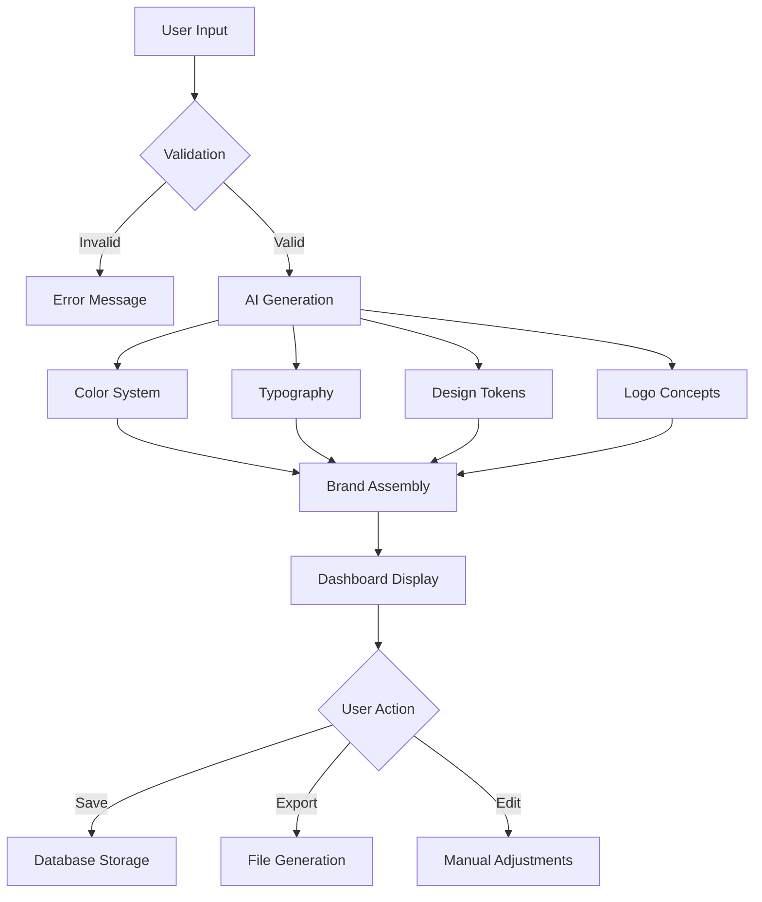
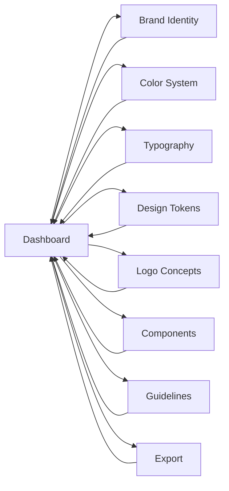

# BrandForge AI - Product Requirements Document

## 1. Product Overview

BrandForge AI is a comprehensive brand platform designed for UI/UX designers working in Figma. It generates complete, professional brand systems inspired by leading Indian and global companies.

The platform enables designers to create brand identities through AI-powered generation, featuring complete color systems, typography, design tokens, UI components, and export capabilities compatible with Figma.

Target Users:
- UI/UX Designers
- Brand Strategists
- Product Teams
- Marketing Teams

## 2. Core Features

### 2.1 User Roles

| Role | Registration Method | Core Permissions |
|------|---------------------|------------------|
| Designer | Email registration | Full access to brand generation, export, and library |
| Guest | No registration | Limited brand generation, no save functionality |

### 2.2 Feature Modules

1. **Dashboard**: Overview of brand system, navigation hub
2. **Brand Identity**: Company name, tagline, values, audience definition
3. **Color System**: Primary, secondary, accent, neutral, semantic colors with full shades
4. **Typography**: Font pairings, type scale, weights, spacing
5. **Design Tokens**: Spacing, shadows, borders, radius, motion values
6. **Logo Concepts**: AI-generated logo descriptions, SVG suggestions
7. **UI Components**: Button, card, input, badge, alert previews with brand styling
8. **Brand Guidelines**: Do/don't rules, voice and tone, usage examples
9. **Export System**: JSON, Tailwind config, Figma variables download

### 2.3 Page Details

| Page Name | Module Name | Feature Description |
|-----------|-------------|---------------------|
| Dashboard | Overview | Brand summary, quick actions, recent brands |
| Brand Identity | Identity Form | Company name, tagline, values, audience, vertical |
| Color System | Palette Display | Primary/secondary/accent/neutral/semantic colors, hex codes, contrast ratios |
| Typography | Type Scale | Font pairings, scale display, weights, line heights |
| Design Tokens | Token Panel | Spacing, radius, shadows, motion values |
| Logo Concepts | Logo Generator | AI descriptions, SVG suggestions, variations |
| Components | Component Showcase | Live previews of buttons, cards, inputs, badges |
| Guidelines | Brand Guidelines | Do/don't rules, voice/tone, usage examples |
| Export | Export Panel | JSON, Tailwind config, Figma variables downloads |

## 3. Core Process

### Brand Generation Flow



### User Navigation Flow



## 4. User Interface Design

### 4.1 Design Style

**Color Palette (Application Theme):**
- Primary: `#0F172A` (Slate 900) - Headers, primary text
- Secondary: `#3B82F6` (Blue 500) - Buttons, links, accents
- Accent: `#10B981` (Emerald 500) - Success states, CTAs
- Background: `#FFFFFF` (White) - Main background
- Surface: `#F8FAFC` (Slate 50) - Cards, panels
- Border: `#E2E8F0` (Slate 200) - Dividers, borders

**Typography:**
- Display/Headings: `Space Grotesk` - Bold, geometric, modern
- Body: `Inter` - Clean, highly readable
- Monospace: `JetBrains Mono` - Code, tokens, hex values

**Button Styles:**
- Primary: Blue 500 background, white text, 8px border-radius, hover shadow
- Secondary: White background, slate border, slate text, hover gray background
- Ghost: Transparent, text only, hover subtle background

**Layout Style:**
- Dashboard-style with collapsible left sidebar (240px width)
- Top header bar (64px height) with logo, search, actions
- Main content area with contextual right sidebar (280px width)
- Card-based content organization

**Icons:**
- Lucide React icon library
- Consistent 20px size for UI elements
- Stroke width 1.5-2 for clarity

### 4.2 Page Design Overview

| Page Name | Module Name | UI Elements |
|-----------|-------------|-------------|
| Dashboard | Overview | Brand summary card, quick actions grid, recent brands list, stats widgets |
| Brand Identity | Identity Form | Form inputs (text, textarea, select), tag input for values, audience selector |
| Color System | Palette Display | Color swatches grid, hex code display, contrast ratio badges, copy buttons |
| Typography | Type Scale | Font preview cards, scale visualization, weight samples, line-height indicators |
| Design Tokens | Token Panel | Token cards with values, category filters, search bar, copy functionality |
| Logo Concepts | Logo Generator | SVG previews, concept cards, download buttons, variation tabs |
| Components | Component Showcase | Live component previews, variant selectors, code snippets, props tables |
| Guidelines | Brand Guidelines | Do/don't comparison cards, voice/tone examples, usage image galleries |
| Export | Export Panel | File format cards, download buttons, preview modals, batch export options |

### 4.3 Responsiveness

**Desktop-First Approach:**
- Primary design: 1440px+ viewport
- Large desktop: 1200px - 1439px
- Desktop: 992px - 1199px
- Tablet: 768px - 991px (sidebar collapses to icons)
- Mobile: < 768px (sidebar becomes drawer, single column layout)

**Touch Optimization:**
- Minimum 44px touch targets
- Swipe gestures for mobile navigation
- Bottom sheet for mobile actions

## 5. Functional Requirements

### 5.1 Brand Generation

**Input Parameters:**
- Company name (required, 2-100 characters)
- Industry vertical (dropdown: Fintech, E-commerce, Healthcare, etc.)
- Brand personality (multi-select: Professional, Friendly, Innovative, etc.)
- Target audience (text description)

**AI Generation Output:**
- Complete color system (primary, secondary, accent, neutral, semantic)
- Typography pairing (heading font, body font)
- Design tokens (spacing, shadows, radius)
- Logo concept descriptions
- Brand voice guidelines

### 5.2 Color System Features

**Display Requirements:**
- Show full color palette with 50-950 shades
- Display hex codes for each color
- Calculate and display WCAG contrast ratios
- Copy-to-clipboard functionality with toast feedback
- Dark mode preview for each color

**Color Categories:**
- Primary (brand main color)
- Secondary (complementary color)
- Accent (highlight/CTA color)
- Neutral (grays for text/backgrounds)
- Semantic (success, warning, error, info)

### 5.3 Typography System

**Display Requirements:**
- Show selected font pairings
- Display full type scale (display, h1-h6, body, caption)
- Show font weights, line heights, letter spacing
- Live preview with editable text
- Google Fonts integration

**Font Categories:**
- Heading font (display, h1-h3)
- Body font (paragraphs, labels)
- Monospace font (code, data)

### 5.4 Design Tokens

**Token Categories:**
- Spacing scale (4px, 8px, 12px, 16px, 24px, 32px, etc.)
- Border radius (sm, md, lg, xl, full)
- Shadows (sm, md, lg, xl, 2xl)
- Motion (duration, easing curves)
- Z-index scale

**Display Requirements:**
- Organize tokens by category
- Show token names and values
- Copy-to-clipboard functionality
- Search/filter capabilities

### 5.5 Export System

**Export Formats:**
1. **brandDetails.json** - Complete brand specification
2. **tailwind.config.js** - Tailwind CSS configuration
3. **figma-variables.json** - Figma design tokens format

**Export Features:**
- Individual file downloads
- ZIP export for all files
- Copy-to-clipboard for code snippets
- Preview before download

## 6. Non-Functional Requirements

### 6.1 Performance

- Initial page load < 2 seconds
- AI generation response < 10 seconds
- Smooth animations at 60fps
- Lazy loading for heavy sections

### 6.2 Accessibility

- WCAG 2.2 AA+ compliance
- Keyboard navigation support
- Screen reader compatibility
- Focus management
- Color contrast ratios ≥ 4.5:1

### 6.3 Browser Support

- Chrome 90+
- Firefox 88+
- Safari 14+
- Edge 90+

### 6.4 Security

- Input validation and sanitization
- XSS protection
- CSRF protection
- Secure session management

## 7. Data Model

### 7.1 Brand Entity

```typescript
interface Brand {
  id: string;
  name: string;
  tagline: string;
  values: string[];
  audience: string;
  vertical: IndustryVertical;
  personality: BrandPersonality[];
  colors: ColorSystem;
  typography: TypographySystem;
  tokens: DesignTokens;
  logos: LogoConcept[];
  guidelines: BrandGuidelines;
  createdAt: Date;
  updatedAt: Date;
  userId: string;
}
```

### 7.2 Supporting Types

```typescript
interface ColorSystem {
  primary: ColorShade;
  secondary: ColorShade;
  accent: ColorShade;
  neutral: ColorShade;
  semantic: {
    success: ColorShade;
    warning: ColorShade;
    error: ColorShade;
    info: ColorShade;
  };
}

interface ColorShade {
  50: string;
  100: string;
  200: string;
  300: string;
  400: string;
  500: string;
  600: string;
  700: string;
  800: string;
  900: string;
  950: string;
}
```

## 8. API Endpoints

### 8.1 Brand Management

| Method | Endpoint | Description |
|--------|----------|-------------|
| POST | /api/brands | Create new brand |
| GET | /api/brands | List user brands |
| GET | /api/brands/:id | Get brand details |
| PUT | /api/brands/:id | Update brand |
| DELETE | /api/brands/:id | Delete brand |

### 8.2 AI Generation

| Method | Endpoint | Description |
|--------|----------|-------------|
| POST | /api/generate | Generate brand from inputs |
| POST | /api/generate/colors | Generate color system only |
| POST | /api/generate/typography | Generate typography only |

### 8.3 Export

| Method | Endpoint | Description |
|--------|----------|-------------|
| GET | /api/export/:id/json | Export brandDetails.json |
| GET | /api/export/:id/tailwind | Export tailwind.config.js |
| GET | /api/export/:id/figma | Export figma-variables.json |

## 9. Implementation Phases

### Phase 1: Core Infrastructure
- Project setup with React + TypeScript + Express
- Database schema and models
- Basic layout and navigation
- AI integration foundation

### Phase 2: Brand Generation
- Brand creation form
- AI generation endpoints
- Color system display
- Typography system display

### Phase 3: Advanced Features
- Design tokens panel
- Logo concept generator
- UI components showcase
- Brand guidelines section

### Phase 4: Export & Polish
- Export system implementation
- Saved brands library
- Accessibility compliance
- Performance optimization

## 10. Success Metrics

- Brand generation completion rate > 90%
- Average generation time < 10 seconds
- Export functionality usage > 70%
- User retention (return visits) > 50%
- WCAG 2.2 AA+ compliance 100%
