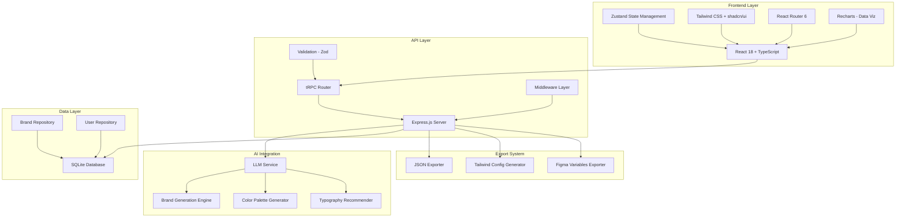
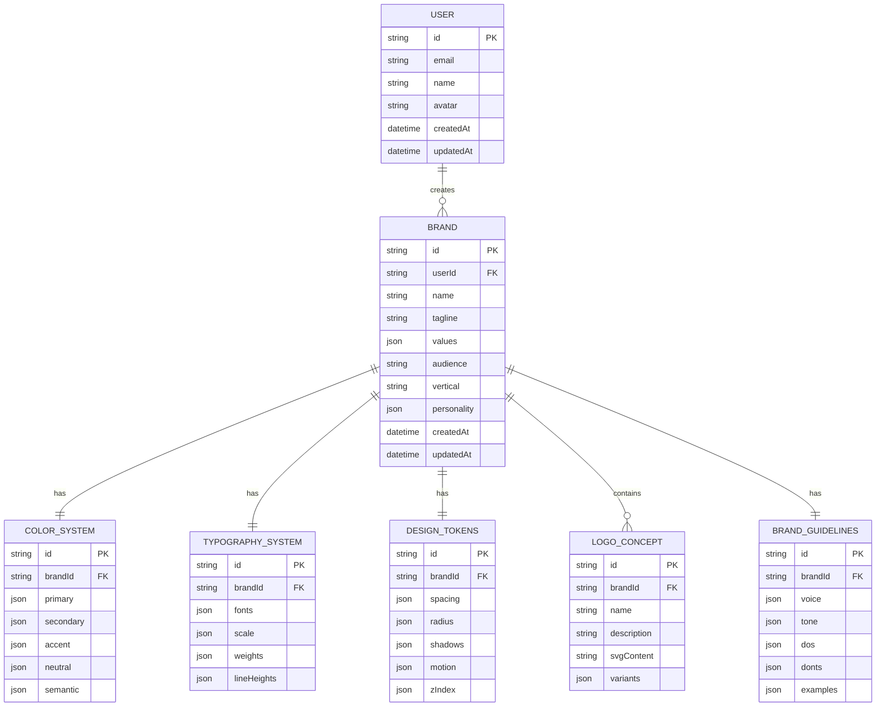

# BrandForge AI - Technical Architecture Document

## 1. Architecture Design



## 2. Technology Description

### 2.1 Frontend Stack

| Technology | Version | Purpose |
|------------|---------|---------|
| React | 18.2.0 | UI library with hooks |
| TypeScript | 5.0+ | Type safety |
| Vite | 4.0+ | Build tool and dev server |
| Tailwind CSS | 3.4+ | Utility-first CSS |
| shadcn/ui | Latest | Component library |
| Zustand | 4.4+ | State management |
| React Router | 6.20+ | Client-side routing |
| Lucide React | Latest | Icon library |
| Recharts | 2.6+ | Data visualization |

### 2.2 Backend Stack

| Technology | Version | Purpose |
|------------|---------|---------|
| Node.js | 18+ | Runtime environment |
| Express.js | 4.18+ | Web framework |
| tRPC | 10.45+ | Type-safe API |
| Zod | 3.22+ | Schema validation |
| SQLite | 3+ | Database |
| Drizzle ORM | 0.29+ | Database ORM |

### 2.3 AI Integration

| Service | Purpose |
|---------|---------|
| Built-in LLM | Brand generation, color palettes, typography |
| Color Generation | Palette generation from brand personality |
| Font Pairing | Typography recommendations |

## 3. Route Definitions

### 3.1 Frontend Routes

| Route | Component | Description |
|-------|-----------|-------------|
| / | Dashboard | Main dashboard with brand overview |
| /create | BrandCreator | Brand generation form |
| /brand/:id | BrandLayout | Brand detail layout with nested routes |
| /brand/:id/identity | IdentitySection | Brand identity details |
| /brand/:id/colors | ColorSystemSection | Color palette display |
| /brand/:id/typography | TypographySection | Type scale display |
| /brand/:id/tokens | TokensSection | Design tokens panel |
| /brand/:id/logos | LogoSection | Logo concepts |
| /brand/:id/components | ComponentsSection | UI component showcase |
| /brand/:id/guidelines | GuidelinesSection | Brand guidelines |
| /brand/:id/export | ExportSection | Export options |
| /library | LibraryPage | Saved brands library |
| /settings | SettingsPage | User settings |

### 3.2 tRPC Procedures

| Procedure | Type | Description |
|-----------|------|-------------|
| brand.create | mutation | Create new brand |
| brand.get | query | Get brand by ID |
| brand.list | query | List user's brands |
| brand.update | mutation | Update brand |
| brand.delete | mutation | Delete brand |
| generate.brand | mutation | Generate brand with AI |
| generate.colors | mutation | Generate color system only |
| generate.typography | mutation | Generate typography only |
| export.json | query | Export brand as JSON |
| export.tailwind | query | Export Tailwind config |
| export.figma | query | Export Figma variables |

## 4. Data Model

### 4.1 Entity Relationship Diagram



### 4.2 Database Schema (SQLite)

```sql
-- Users table
CREATE TABLE users (
    id TEXT PRIMARY KEY,
    email TEXT UNIQUE NOT NULL,
    name TEXT,
    avatar TEXT,
    created_at DATETIME DEFAULT CURRENT_TIMESTAMP,
    updated_at DATETIME DEFAULT CURRENT_TIMESTAMP
);

-- Brands table
CREATE TABLE brands (
    id TEXT PRIMARY KEY,
    user_id TEXT NOT NULL,
    name TEXT NOT NULL,
    tagline TEXT,
    values TEXT, -- JSON array
    audience TEXT,
    vertical TEXT,
    personality TEXT, -- JSON array
    created_at DATETIME DEFAULT CURRENT_TIMESTAMP,
    updated_at DATETIME DEFAULT CURRENT_TIMESTAMP,
    FOREIGN KEY (user_id) REFERENCES users(id) ON DELETE CASCADE
);

-- Color systems table
CREATE TABLE color_systems (
    id TEXT PRIMARY KEY,
    brand_id TEXT UNIQUE NOT NULL,
    primary_colors TEXT NOT NULL, -- JSON object with 50-950 shades
    secondary_colors TEXT NOT NULL,
    accent_colors TEXT NOT NULL,
    neutral_colors TEXT NOT NULL,
    semantic_colors TEXT NOT NULL,
    FOREIGN KEY (brand_id) REFERENCES brands(id) ON DELETE CASCADE
);

-- Typography systems table
CREATE TABLE typography_systems (
    id TEXT PRIMARY KEY,
    brand_id TEXT UNIQUE NOT NULL,
    fonts TEXT NOT NULL, -- JSON with heading, body, mono
    scale TEXT NOT NULL, -- JSON with display, h1-h6, body sizes
    weights TEXT NOT NULL,
    line_heights TEXT NOT NULL,
    FOREIGN KEY (brand_id) REFERENCES brands(id) ON DELETE CASCADE
);

-- Design tokens table
CREATE TABLE design_tokens (
    id TEXT PRIMARY KEY,
    brand_id TEXT UNIQUE NOT NULL,
    spacing TEXT NOT NULL, -- JSON array
    radius TEXT NOT NULL,
    shadows TEXT NOT NULL,
    motion TEXT NOT NULL,
    z_index TEXT NOT NULL,
    FOREIGN KEY (brand_id) REFERENCES brands(id) ON DELETE CASCADE
);

-- Logo concepts table
CREATE TABLE logo_concepts (
    id TEXT PRIMARY KEY,
    brand_id TEXT NOT NULL,
    name TEXT NOT NULL,
    description TEXT,
    svg_content TEXT,
    variants TEXT, -- JSON array
    created_at DATETIME DEFAULT CURRENT_TIMESTAMP,
    FOREIGN KEY (brand_id) REFERENCES brands(id) ON DELETE CASCADE
);

-- Brand guidelines table
CREATE TABLE brand_guidelines (
    id TEXT PRIMARY KEY,
    brand_id TEXT UNIQUE NOT NULL,
    voice TEXT NOT NULL, -- JSON
    tone TEXT NOT NULL,
    dos TEXT NOT NULL, -- JSON array
    donts TEXT NOT NULL,
    examples TEXT NOT NULL,
    FOREIGN KEY (brand_id) REFERENCES brands(id) ON DELETE CASCADE
);

-- Create indexes for performance
CREATE INDEX idx_brands_user_id ON brands(user_id);
CREATE INDEX idx_brands_created_at ON brands(created_at);
CREATE INDEX idx_logos_brand_id ON logo_concepts(brand_id);
```

## 5. AI Integration Architecture

### 5.1 LLM Service Layer

```typescript
// LLM Service Interface
interface LLMService {
  generateBrandIdentity(input: BrandInput): Promise<BrandIdentity>;
  generateColorSystem(personality: string[]): Promise<ColorSystem>;
  generateTypography(industry: string): Promise<TypographySystem>;
  generateLogoConcepts(brand: Brand): Promise<LogoConcept[]>;
}

// Brand Generation Prompt Template
interface BrandGenerationPrompt {
  system: string;
  user: {
    companyName: string;
    industry: string;
    personality: string[];
    audience: string;
  };
}
```

### 5.2 Generation Prompts

**Brand Identity Generation:**
```
System: You are BrandForge AI, an expert brand strategist and designer. Create comprehensive brand identities that are professional, memorable, and aligned with the company's vision.

User Input: {companyName}, {industry}, {personality}, {audience}

Generate:
1. A compelling tagline (max 8 words)
2. 3-5 core brand values
3. Primary brand personality traits
4. Target audience description
5. Brand voice characteristics

Return as structured JSON.
```

**Color System Generation:**
```
System: You are a color theory expert. Generate harmonious, accessible color palettes that reflect brand personality.

Input: {brandPersonality}, {industry}

Generate:
1. Primary color with full 50-950 shade scale
2. Secondary complementary color with full scale
3. Accent color for CTAs and highlights
4. Neutral grayscale (slate/gray)
5. Semantic colors (success, warning, error, info)

Ensure WCAG 2.2 AA+ contrast ratios.
Return as structured JSON with hex codes.
```

## 6. Export System Architecture

### 6.1 Export Format Specifications

**brandDetails.json:**
```json
{
  "meta": {
    "version": "1.0",
    "generatedBy": "BrandForge AI",
    "generatedAt": "2024-01-15T10:30:00Z"
  },
  "identity": {
    "name": "Company Name",
    "tagline": "Tagline here",
    "values": ["Value 1", "Value 2"],
    "audience": "Target audience description",
    "vertical": "Fintech",
    "personality": ["Professional", "Innovative"]
  },
  "visuals": {
    "colors": { /* Full color system */ },
    "typography": { /* Typography system */ },
    "logo": { /* Logo specifications */ }
  },
  "tokens": { /* Design tokens */ },
  "guidelines": { /* Brand guidelines */ }
}
```

**tailwind.config.js:**
```javascript
module.exports = {
  theme: {
    extend: {
      colors: {
        primary: {
          50: '#f0f9ff',
          100: '#e0f2fe',
          // ... 50-950 shades
        },
        // ... other colors
      },
      fontFamily: {
        heading: ['Space Grotesk', 'sans-serif'],
        body: ['Inter', 'sans-serif'],
      },
      spacing: {
        '4': '4px',
        '8': '8px',
        // ... spacing scale
      },
    },
  },
}
```

## 7. Testing Strategy

### 7.1 Unit Tests

- Component rendering tests
- Utility function tests
- Hook behavior tests
- Store state management tests

### 7.2 Integration Tests

- API endpoint tests
- Database query tests
- AI generation flow tests
- Export functionality tests

### 7.3 E2E Tests

- Complete brand generation flow
- Navigation between sections
- Export and download flows
- Responsive behavior tests

## 8. Deployment Strategy

### 8.1 Environment Setup

```
Development:
- Local SQLite database
- Local LLM service
- Hot reload enabled

Production:
- Managed database (optional upgrade)
- Built-in LLM service
- Optimized build
```

### 8.2 Build Process

```bash
# Frontend build
npm run build

# Backend preparation
npm run server:build

# Production start
npm run start
```

## 9. Security Considerations

### 9.1 Input Validation

- Zod schemas for all inputs
- SQL injection prevention via ORM
- XSS protection via output encoding
- File upload restrictions

### 9.2 Authentication

- Session-based auth
- CSRF token protection
- Secure cookie settings
- Rate limiting on auth endpoints

### 9.3 Data Protection

- Encryption at rest (SQLite)
- Secure transmission (HTTPS)
- Data retention policies
- Privacy compliance

## 10. Monitoring & Analytics

### 10.1 Key Metrics

- Brand generation success rate
- Average generation time
- Export usage statistics
- User engagement metrics

### 10.2 Error Tracking

- API error rates
- Frontend crash reports
- AI generation failures
- Database query performance

### 10.3 Performance Monitoring

- Page load times
- API response times
- AI generation latency
- Database query times
