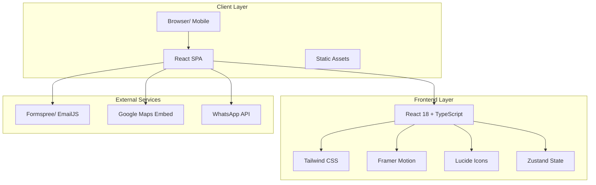

# Technical Architecture Document
## Vatsalya Child & Dental Specialty Hospital Website

---

## 1. Architecture Design

### System Architecture Diagram



---

## 2. Technology Description

### 2.1 Frontend Stack

| Technology | Version | Purpose |
|------------|---------|---------|
| React | 18.x | UI Library |
| TypeScript | 5.x | Type Safety |
| Vite | 5.x | Build Tool |
| Tailwind CSS | 3.x | Styling |
| Framer Motion | 11.x | Animations |
| Lucide React | 0.x | Icons |
| Zustand | 4.x | State Management |
| React Hook Form | 7.x | Form Handling |
| Zod | 3.x | Schema Validation |

### 2.2 Development Tools

| Tool | Purpose |
|------|---------|
| ESLint | Code Linting |
| Prettier | Code Formatting |
| PostCSS | CSS Processing |
| Autoprefixer | CSS Vendor Prefixes |

### 2.3 External Services

| Service | Purpose |
|---------|---------|
| Formspree / EmailJS | Form submission handling |
| Google Maps Embed | Location display |
| WhatsApp API | Direct messaging |

---

## 3. Route Definitions

Since this is a single-page application with scroll-based navigation, we use anchor-based routing:

| Route/Anchor | Section | Description |
|--------------|---------|-------------|
| `#home` | Hero Section | Landing area with main CTA |
| `#about` | About Us | Hospital introduction |
| `#doctors` | Our Doctors | Doctor profiles |
| `#services` | Services | Medical services offered |
| `#timings` | OPD Timings | Schedule display |
| `#gallery` | Gallery | Photo gallery |
| `#testimonials` | Testimonials | Patient reviews |
| `#contact` | Contact | Contact form and map |

---

## 4. Component Architecture

### 4.1 Component Hierarchy

```
App
├── Navbar (Fixed, responsive)
├── HeroSection (Full viewport, animated)
├── AboutSection (Two-column layout)
├── DoctorsSection (Card grid)
│   └── DoctorCard
├── ServicesSection (Icon grid)
│   └── ServiceCard
├── TimingsSection (Schedule display)
├── GallerySection (Masonry grid)
│   └── GalleryImage
├── TestimonialsSection (Carousel)
│   └── TestimonialCard
├── ContactSection (Form + Map)
│   └── ContactForm
├── Footer (Multi-column)
├── FloatingButtons (WhatsApp + ScrollTop)
└── AppointmentModal (Booking form)
    └── BookingForm
```

### 4.2 Shared Components

| Component | Location | Purpose |
|-----------|----------|---------|
| Button | `components/ui/Button.tsx` | Reusable button variants |
| Card | `components/ui/Card.tsx` | Reusable card container |
| Input | `components/ui/Input.tsx` | Form input component |
| Modal | `components/ui/Modal.tsx` | Modal overlay component |
| SectionHeader | `components/SectionHeader.tsx` | Consistent section titles |
| ScrollReveal | `components/ScrollReveal.tsx` | Scroll-triggered animations |

---

## 5. State Management

### 5.1 Zustand Store Structure

```typescript
interface AppState {
  // UI State
  isAppointmentModalOpen: boolean;
  isMobileMenuOpen: boolean;
  activeSection: string;
  
  // Form State
  appointmentForm: AppointmentFormData;
  contactForm: ContactFormData;
  
  // Actions
  toggleAppointmentModal: () => void;
  toggleMobileMenu: () => void;
  setActiveSection: (section: string) => void;
  updateAppointmentForm: (data: Partial<AppointmentFormData>) => void;
  resetForms: () => void;
}
```

---

## 6. Animation Specifications

### 6.1 Animation Library: Framer Motion

| Animation | Implementation | Timing |
|-----------|----------------|--------|
| Hero Text Reveal | `staggerChildren` container, `y: 30 -> 0` with opacity | 0.8s, ease-out |
| Hero Background | Floating bubbles, `y` oscillation | 6s, infinite, ease-in-out |
| Scroll Reveal | `whileInView`, `y: 50 -> 0` with opacity | 0.6s, ease-out |
| Card Hover | `whileHover`, `scale: 1.03`, shadow increase | 0.3s, ease-out |
| Button Hover | `whileHover`, `scale: 1.05` | 0.2s, ease-out |
| Modal Open | `AnimatePresence`, `scale: 0.9 -> 1`, opacity | 0.3s, spring |
| Counter Animation | Custom hook, number increment | 2s, ease-out |
| Gallery Lightbox | `AnimatePresence`, fade and scale | 0.3s, ease-out |
| Testimonial Slide | Auto-advance, `x` translation | 5s interval, 0.5s transition |
| Floating Buttons | Entrance animation, `y: 100 -> 0` | 0.5s, spring |
| Parallax Effect | Scroll-based `y` translation | Continuous |

---

## 7. Project Structure

```
vatsalya-hospital/
├── public/
│   ├── images/
│   │   ├── hero-bg.jpg
│   │   ├── doctor-1.jpg
│   │   ├── doctor-2.jpg
│   │   └── gallery/
│   └── favicon.ico
├── src/
│   ├── components/
│   │   ├── ui/
│   │   │   ├── Button.tsx
│   │   │   ├── Card.tsx
│   │   │   ├── Input.tsx
│   │   │   └── Modal.tsx
│   │   ├── layout/
│   │   │   ├── Navbar.tsx
│   │   │   ├── Footer.tsx
│   │   │   └── FloatingButtons.tsx
│   │   ├── sections/
│   │   │   ├── HeroSection.tsx
│   │   │   ├── AboutSection.tsx
│   │   │   ├── DoctorsSection.tsx
│   │   │   ├── ServicesSection.tsx
│   │   │   ├── TimingsSection.tsx
│   │   │   ├── GallerySection.tsx
│   │   │   ├── TestimonialsSection.tsx
│   │   │   └── ContactSection.tsx
│   │   ├── shared/
│   │   │   ├── SectionHeader.tsx
│   │   │   ├── ScrollReveal.tsx
│   │   │   └── Counter.tsx
│   │   └── modals/
│   │       └── AppointmentModal.tsx
│   ├── hooks/
│   │   ├── useScrollPosition.ts
│   │   ├── useInView.ts
│   │   └── useCounter.ts
│   ├── store/
│   │   └── useStore.ts
│   ├── types/
│   │   └── index.ts
│   ├── utils/
│   │   └── helpers.ts
│   ├── styles/
│   │   └── globals.css
│   ├── App.tsx
│   └── main.tsx
├── index.html
├── package.json
├── tsconfig.json
├── vite.config.ts
├── tailwind.config.js
├── postcss.config.js
├── eslint.config.js
└── .gitignore
```

---

## 8. Dependencies

### 8.1 Production Dependencies

```json
{
  "dependencies": {
    "react": "^18.2.0",
    "react-dom": "^18.2.0",
    "framer-motion": "^11.0.0",
    "zustand": "^4.5.0",
    "lucide-react": "^0.344.0",
    "react-hook-form": "^7.51.0",
    "zod": "^3.22.0",
    "@hookform/resolvers": "^3.3.0",
    "clsx": "^2.1.0",
    "tailwind-merge": "^2.2.0"
  }
}
```

### 8.2 Development Dependencies

```json
{
  "devDependencies": {
    "@types/react": "^18.2.0",
    "@types/react-dom": "^18.2.0",
    "@vitejs/plugin-react": "^4.2.0",
    "typescript": "^5.3.0",
    "vite": "^5.1.0",
    "tailwindcss": "^3.4.0",
    "postcss": "^8.4.0",
    "autoprefixer": "^10.4.0",
    "eslint": "^8.57.0",
    "@typescript-eslint/eslint-plugin": "^7.0.0",
    "@typescript-eslint/parser": "^7.0.0",
    "eslint-plugin-react-hooks": "^4.6.0",
    "eslint-plugin-react-refresh": "^0.4.0"
  }
}
```

---

## 9. Security Considerations

- Form validation on both client and server sides
- Sanitization of user inputs
- HTTPS for all communications
- Content Security Policy headers
- Protection against XSS and CSRF attacks
- Rate limiting for form submissions
- No sensitive data in client-side storage

---

## 10. Deployment Strategy

### 10.1 Build Process

1. Run `npm run build` or `pnpm build`
2. Vite bundles the application
3. Output goes to `dist/` directory
4. All assets are optimized and hashed

### 10.2 Hosting Options

| Platform | Best For | Setup Complexity |
|----------|----------|------------------|
| Vercel | Quick deployment, preview deployments | Low |
| Netlify | Forms handling, edge functions | Low |
| AWS S3 + CloudFront | Enterprise scale, CDN | Medium |
| GitHub Pages | Simple static sites | Low |

### 10.3 Environment Variables

```env
# .env.production
VITE_APP_NAME=Vatsalya Hospital
VITE_APP_URL=https://vatsalyahospital.com
VITE_FORMSPREE_ID=your_formspree_id
VITE_WHATSAPP_NUMBER=918292114160
```

---

## 11. Testing Strategy

### 11.1 Manual Testing Checklist

- [ ] All navigation links work correctly
- [ ] Responsive design on mobile, tablet, desktop
- [ ] Appointment form validation
- [ ] Contact form submission
- [ ] Modal open/close functionality
- [ ] Smooth scroll to sections
- [ ] All animations work smoothly
- [ ] WhatsApp button opens correct link
- [ ] Map embed loads correctly

### 11.2 Cross-Browser Testing

- Chrome/Edge (Chromium)
- Firefox
- Safari (macOS/iOS)
- Mobile browsers (Chrome Mobile, Safari Mobile)

### 11.3 Performance Testing

- Lighthouse score > 90
- First Contentful Paint < 1.8s
- Time to Interactive < 3.8s
- Cumulative Layout Shift < 0.1

---

**Document Version**: 1.0  
**Last Updated**: 2026-07-01  
**Status**: Draft
